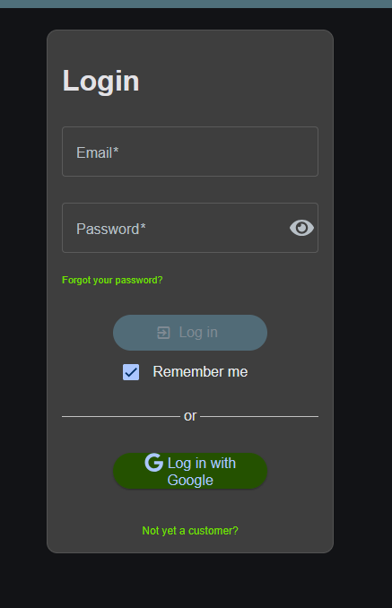
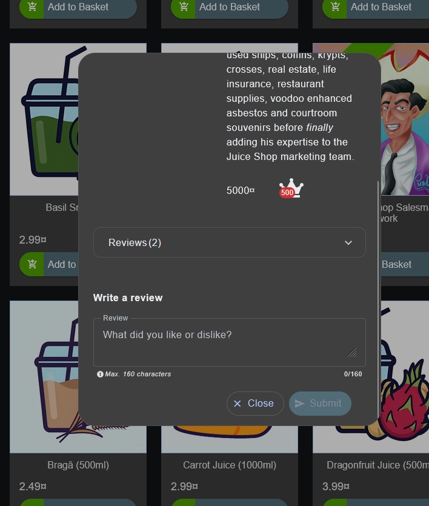
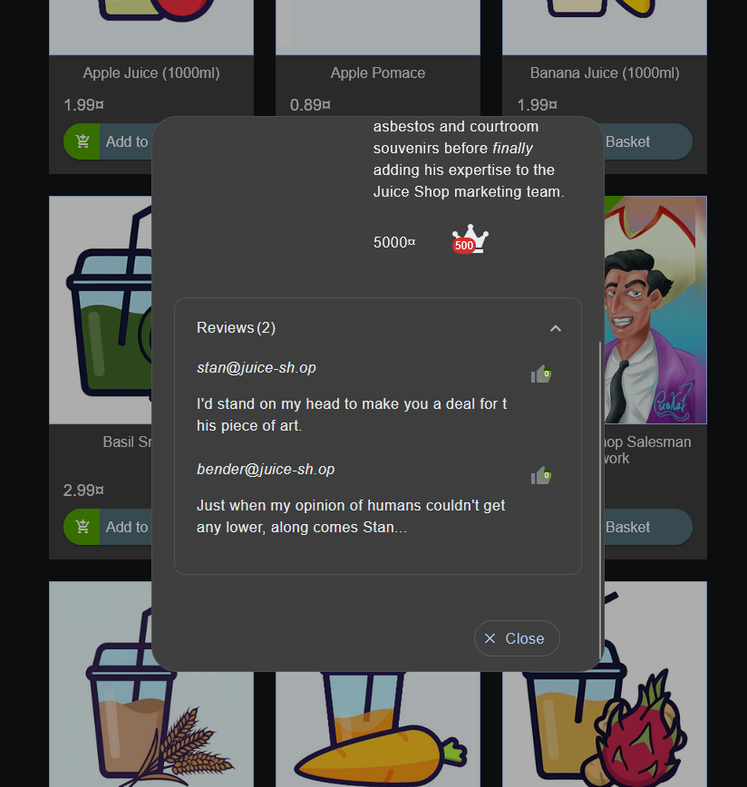

---

title: "OWASP Juice Shop「Login Jim」をSQL Injectionで攻略してみた🧃"
emoji: "🧃"
type: "tech" # tech: 技術記事 / idea: アイデア
topics: ["burpsuite", "OWASP Juice Shop", "SQL Injection", "security"]
published: true
---

私はPortSwiggerのSQL Injectionの問題を全問解き終わったため、OWASP Juice ShopのSQL Injectionの問題を解き始めました！！！!

その記念すべき一問目がこれです！！！

## 問題文：Login Jim

まず、ログイン画面を開きます。

PortSwiggerの問題と違い、usernameとpasswordではなく、emailとpasswordか、、（別にそこまで変わらないのに解けない気がする😭😭😭）

emailがどのような形式なのかを調べるため、商品詳細をどれでもいいから見てみるか。

お！！Reviewsがあるぞ！！！！

これは英語が苦手な私でも分かるぞ、レビューってことだ！！

押すと、

やったー！！！

異なるemailアドレスが2つ出てきた！！
それに同じ形式だ！！

Reviewsから`@juice-sh.op`というemailの形式を確認できた。

今回ログインするユーザーはJimなので、`jim@juice-sh.op`ではないかと推測した😏

次はパスワードか、、、、

★3の問題だし、そこまで複雑ではないはず！！
（私は難しく考えてUNIONを使ったり、色んなことをしてしまいましたー）

パスワードの判定部分を無視させることができればログインできそうだ。

そこで、emailの後ろに`'--`を入力してみる。

`'`で文字列を閉じ、`--`以降をSQLのコメントとして扱わせることで、後ろにあるパスワードの判定部分を無効化できないか試してみる！！

（`--`は初心者でも便利さが分かるくらいマジで便利）

つまり、

`jim@juice-sh.op'--`

にして、パスワードは適当に文字を入力してっと。

できたー！！！

初めてのOWASP Juice Shopの問題解けたぞー！！🧃✨

今回の問題では、Reviewsからemailアドレスの形式を確認し、対象ユーザーのemailを推測しました。

そして、SQL Injectionを利用してパスワードの判定部分をコメントアウトすることで、Jimとしてログインすることができました！！

これからもOWASP Juice ShopやPortSwiggerの問題を、初心者でも分かるくらい簡単に解説するのでぜひ見てほしいです！！！
